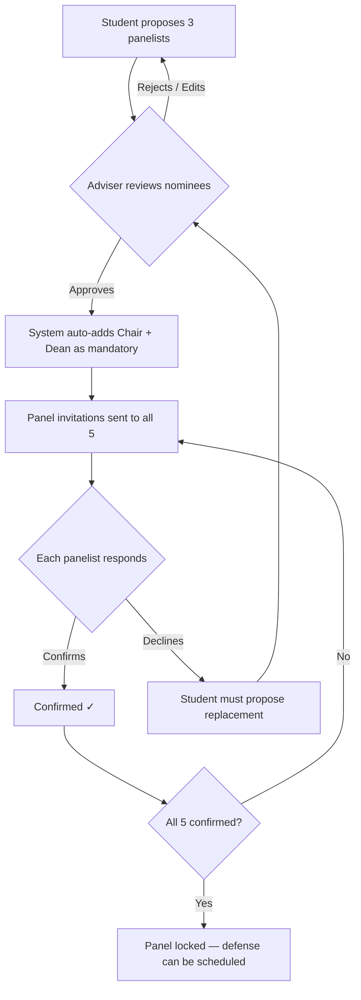

# Integrated Student Research & Capstone Portal

> **Client:** ISUFST — CICT, Dingle Campus
> **Stack:** Turborepo · Next.js 15 (App Router) · Prisma · Supabase (Auth, Storage, PostgreSQL) · PWA
> **Branding:** Maroon & Gold academic aesthetic

---

## Proposed Changes

### Monorepo Structure

```
capstone-portal/
├── apps/
│   └── web/                         # Single Next.js 15 app (App Router + RSC)
│       ├── public/                  # PWA manifest, icons, SW
│       ├── src/
│       │   ├── app/
│       │   │   ├── (public)/        # Landing, Archive, Login
│       │   │   ├── (auth)/          # Login, Register
│       │   │   ├── student/         # Student workspace
│       │   │   ├── faculty/         # Adviser & Panel workspace
│       │   │   └── admin/           # Admin dashboard
│       │   ├── components/          # App-specific composed components
│       │   ├── hooks/               # Custom React hooks
│       │   ├── lib/                 # Utilities, constants, helpers
│       │   └── styles/              # Global CSS + design tokens
│       └── next.config.ts
├── packages/
│   ├── ui/                          # Shared UI primitives (Button, Card, Modal, etc.)
│   ├── database/                    # Prisma schema, client, seed scripts
│   ├── storage/                     # Supabase Storage utilities
│   ├── auth/                        # Auth helpers, RBAC guards
│   └── config/                      # Shared tsconfig, eslint configs
├── turbo.json
└── package.json
```

> [!IMPORTANT]
> **Styling Decision:** Given the project scale (responsive + PWA + multiple dashboards + dark mode), I recommend **Tailwind CSS v4** over vanilla CSS. Your existing monorepo projects (obbo, ICTIRC) already use Tailwind, ensuring pattern consistency. Please confirm or override.

---

### Route Map

| Route Group | Key Pages | Access |
|---|---|---|
| `(public)` | `/` landing, `/archive` search, `/archive/[id]` detail | Public |
| `(auth)` | `/login`, `/register` | Unauthenticated |
| `student/*` | `dashboard`, `group`, `project/documents`, `project/milestones`, `project/title-check`, `project/panel`, `project/defense/[stage]` | `STUDENT` |
| `faculty/*` | `dashboard`, `advised/[groupId]`, `panels/[projectId]`, `evaluate/[projectId]/[stage]`, `annotations/[versionId]` | `FACULTY` |
| `admin/*` | `dashboard` (analytics), `users`, `projects`, `groups`, `rubrics`, `defense-schedule`, `archive`, `settings` | `ADMIN` |

---

### Database Schema (Prisma + raw SQL for pg_trgm)

#### Core Enums

```prisma
enum UserRole        { STUDENT  FACULTY  ADMIN }
enum FacultyPosition { INSTRUCTOR  PROGRAM_CHAIR  DEAN }
enum GroupStatus      { FORMING  ACTIVE  COMPLETED  DISSOLVED }
enum DefenseStage    { TITLE  PRE_ORAL  TECHNICAL  FINAL }
enum ProjectStatus   { TITLE_PROPOSAL  TITLE_APPROVED  IN_PROGRESS  PRE_ORAL_STAGE
                       TECHNICAL_STAGE  FINAL_STAGE  COMPLETED  ARCHIVED }
enum MilestoneStatus { TODO  IN_PROGRESS  FOR_REVIEW  DONE }
enum PanelStatus     { NOMINATED  CONFIRMED  DECLINED }
enum DocType         { DOCX  PDF }
enum AnnotationType  { COMMENT  SUGGESTION  CORRECTION  MUST_FIX }
enum DefenseVerdict  { PASS  CONDITIONAL  FAIL }
enum Semester        { FIRST  SECOND  SUMMER }
```

#### Tables Overview

| Table | Purpose | Key Relations |
|---|---|---|
| `users` | All users synced from Supabase Auth | role, faculty_position |
| `capstone_groups` | Student groups (4-5 members) | → adviser (users), → members |
| `group_members` | Junction: user ↔ group | role_in_group (LEADER/MEMBER) |
| `capstone_projects` | One per group, the core entity | → group, → panel, → documents |
| `panel_assignments` | 5 panelists per project (3 nominated + chair + dean) | confirmation workflow flags |
| `document_versions` | Versioned .docx/.pdf uploads | auto-incrementing version_number |
| `document_annotations` | Paragraph-level comments on document HTML | paragraph_index, text selection offsets |
| `milestones` | Kanban items per project | status columns, ordering |
| `evaluation_rubrics` | Admin-editable rubric templates per defense stage | one active rubric per stage |
| `rubric_criteria` | Individual criteria within a rubric | category, max_score, weight |
| `defense_schedules` | Scheduled defense events | date, venue, stage |
| `evaluations` | One per panelist per defense | → rubric, verdict, total score |
| `evaluation_scores` | Individual criteria scores within an evaluation | score, comment |
| `historical_titles` | Seeded + accumulated titles for pg_trgm | GIN-indexed |
| `notifications` | In-app notification feed | type, link, is_read |

#### Key Schema Details

```prisma
model User {
  id               String          @id @default(uuid()) // synced with Supabase Auth
  email            String          @unique
  firstName        String
  lastName         String
  role             UserRole
  facultyPosition  FacultyPosition? // only for FACULTY
  avatarUrl        String?
  studentNumber    String?          // only for STUDENT
  department       String           @default("CICT")
  isActive         Boolean          @default(true)
  createdAt        DateTime         @default(now())
  updatedAt        DateTime         @updatedAt

  // Relations
  advisedGroups    CapstoneGroup[]  @relation("Adviser")
  groupMemberships GroupMember[]
  panelAssignments PanelAssignment[]
  evaluations      Evaluation[]
  annotations      DocumentAnnotation[]
  notifications    Notification[]
}

model CapstoneProject {
  id                  String        @id @default(uuid())
  groupId             String        @unique
  title               String
  abstract            String?
  techStack           String[]      @default([])
  domain              String?       // agriculture, aquaculture, campus_automation, etc.
  status              ProjectStatus @default(TITLE_PROPOSAL)
  currentDefenseStage DefenseStage?
  isPublic            Boolean       @default(false)
  createdAt           DateTime      @default(now())
  updatedAt           DateTime      @updatedAt

  group             CapstoneGroup       @relation(fields: [groupId], references: [id])
  panelAssignments  PanelAssignment[]
  documentVersions  DocumentVersion[]
  milestones        Milestone[]
  defenseSchedules  DefenseSchedule[]
  evaluations       Evaluation[]
}

model DocumentVersion {
  id            String   @id @default(uuid())
  projectId     String
  versionNumber Int      // auto-incremented per project
  fileName      String
  fileUrl       String   // Supabase Storage URL
  fileType      DocType
  fileSize      BigInt
  htmlContent   String?  // mammoth.js conversion for annotation
  defenseStage  DefenseStage?
  uploadedBy    String
  createdAt     DateTime @default(now())

  project     CapstoneProject      @relation(fields: [projectId], references: [id])
  uploader    User                 @relation(fields: [uploadedBy], references: [id])
  annotations DocumentAnnotation[]

  @@unique([projectId, versionNumber])
}

model DocumentAnnotation {
  id                String         @id @default(uuid())
  documentVersionId String
  authorId          String
  paragraphIndex    Int
  selectedText      String?
  startOffset       Int?
  endOffset         Int?
  comment           String
  annotationType    AnnotationType @default(COMMENT)
  isResolved        Boolean        @default(false)
  resolvedBy        String?
  createdAt         DateTime       @default(now())
  updatedAt         DateTime       @updatedAt

  documentVersion DocumentVersion @relation(fields: [documentVersionId], references: [id])
  author          User            @relation(fields: [authorId], references: [id])
}
```

#### pg_trgm Setup (Raw SQL Migration)

```sql
-- Enable extension
CREATE EXTENSION IF NOT EXISTS pg_trgm;

-- GIN index on historical titles
CREATE INDEX idx_historical_titles_trgm
ON historical_titles USING GIN (title gin_trgm_ops);

-- Similarity search function
CREATE OR REPLACE FUNCTION search_similar_titles(query_title TEXT, threshold FLOAT DEFAULT 0.3)
RETURNS TABLE(id UUID, title TEXT, year INT, similarity FLOAT) AS $$
  SELECT id, title, year, similarity(title, query_title) AS similarity
  FROM historical_titles
  WHERE similarity(title, query_title) >= threshold
  ORDER BY similarity DESC
  LIMIT 20;
$$ LANGUAGE sql;
```

**Similarity Thresholds:**
- `≥ 0.3` — Informational: "Related titles found" (gray badge)
- `≥ 0.5` — Warning: "Similar title exists" (yellow warning)
- `≥ 0.7` — Blocking: "Likely duplicate — requires adviser override" (red alert)

---

### Panel Nomination & Confirmation Workflow



---

### Document Annotation System

**Upload Flow:**
1. Student uploads `.docx` → stored in Supabase Storage bucket `manuscripts`
2. Server Action runs `mammoth.js` to convert `.docx` → structured HTML
3. HTML stored in `document_versions.htmlContent`
4. Version number auto-incremented via DB query (`MAX(version_number) + 1`)

**Annotation UI:**
1. HTML rendered in a custom `<DocumentViewer>` component
2. Each `<p>` tag wrapped with a clickable annotation target (paragraph index)
3. Faculty selects text → annotation sidebar opens with comment form
4. Annotations displayed as highlighted text with margin indicators
5. Filter by: annotation type, resolved status, author
6. Students see annotations as read-only with a "Mark as Addressed" action

**PDF Handling:**
- PDFs rendered via `react-pdf` for viewing only
- Annotations on PDFs use page-level comments (simpler than paragraph-level)

---

### Defense Evaluation System

**4-Stage Pipeline:**

| Stage | Typical Focus | Triggers |
|---|---|---|
| Title Defense | Feasibility, relevance, originality | After title proposal + panel lock |
| Pre-Oral Defense | Lit review, methodology, progress | After Ch1-3 submission |
| Technical Defense | Implementation, testing, code quality | After system demo |
| Final Defense | Complete evaluation, manuscript quality | After final manuscript |

**Rubric Builder (Admin):**
- Admin creates/edits rubric templates per defense stage
- Each rubric has criteria grouped by category (e.g., "Content", "Technical Merit", "Presentation")
- Each criterion has: name, description, max_score (1-10 default), weight (%)
- Weights within a rubric must total 100%
- Only one active rubric per defense stage at a time

**Grading Flow:**
1. Admin schedules defense → panelists notified
2. During/after defense, each panelist fills out the digital rubric
3. System computes: `panelist_total = Σ(score × weight)` for each panelist
4. Final grade = `AVG(all_panelist_totals)`
5. Each panelist also selects a verdict: PASS / CONDITIONAL / FAIL
6. Majority verdict determines outcome

---

### PWA Configuration

Using `@serwist/next` (modern successor to `next-pwa`):

- **Manifest:** App name, maroon theme color, icons (192×192, 512×512)
- **Service Worker:** Cache-first for static assets, network-first for API calls
- **Offline:** Basic offline page with "You're offline" message
- **Install Prompt:** Custom install banner for mobile users

---

### Supabase Configuration

**Storage Buckets:**

| Bucket | Purpose | RLS Policy |
|---|---|---|
| `manuscripts` | .docx and .pdf uploads | Group members + assigned panel + admin |
| `avatars` | Profile pictures | Owner + admin |

**Auth:**
- Email/password registration with email verification
- Role assigned during registration (student vs faculty selection)
- Admin accounts created via seed or admin panel invitation

**Row-Level Security:**
- Manuscripts: `auth.uid() IN (group_members) OR auth.uid() IN (panel_assignments) OR role = 'ADMIN'`
- Avatars: `auth.uid() = owner_id OR role = 'ADMIN'`

---

### Key Libraries

| Library | Purpose |
|---|---|
| `mammoth` | .docx → HTML conversion (server-side) |
| `react-pdf` | PDF viewing in browser |
| `@hello-pangea/dnd` | Kanban drag-and-drop |
| `recharts` | Analytics charts |
| `@serwist/next` | PWA service worker |
| `zod` | Schema validation |
| `react-hook-form` | Form state management |
| `lucide-react` | Icon library |
| `date-fns` | Date formatting |

---

## Phase Breakdown

### Phase 1: Architecture & Security (Weeks 1-2)

#### [NEW] Turborepo Initialization
- `turbo.json`, root `package.json`, `pnpm-workspace.yaml`
- Shared `tsconfig`, `eslint` in `packages/config/`

#### [NEW] `apps/web` — Next.js 15 App
- App Router with route groups: `(public)`, `(auth)`, `student/`, `faculty/`, `admin/`
- Global layout with maroon/gold design tokens, Inter/Outfit typography
- PWA manifest + service worker setup via `@serwist/next`
- Responsive shell: collapsible sidebar (desktop) → bottom nav (mobile)

#### [NEW] `packages/auth`
- Supabase Auth client utilities
- `middleware.ts` — RBAC route protection: redirect by role, block unauthorized access
- `useSession` hook, `requireRole()` server-side guard

#### [NEW] `packages/ui`
- Design system primitives: Button, Input, Card, Modal, Badge, Tabs, Avatar, Dropdown
- Maroon/gold theme with dark mode support
- `<DocumentViewer>` shell component (Phase 3)

#### [NEW] `packages/database`
- Full Prisma schema (all models listed above)
- Raw SQL migration for `pg_trgm` extension + GIN index
- Prisma Client singleton export

#### [NEW] `packages/storage`
- Supabase Storage client for `manuscripts` and `avatars` buckets
- Upload, download, delete utilities with RLS-aware paths

---

### Phase 2: Core Data Layer & Search (Weeks 3-4)

#### [NEW] Database Seed Script (`packages/database/seed.ts`)
- 5 faculty users (1 dean, 1 program chair, 3 instructors)
- 15 student users across 3 groups
- 3 sample capstone projects with titles
- 50+ historical titles for pg_trgm testing (mix of agriculture, aquaculture, campus automation)
- Default rubric templates for all 4 defense stages

#### [NEW] Title Verification API (`apps/web/src/app/api/title-check`)
- Server Action: accepts query title → runs `search_similar_titles()` via `prisma.$queryRaw`
- Returns ranked results with similarity scores + color-coded severity
- Debounced frontend input with live results

#### [NEW] User Registration Flow
- Role selection (Student / Faculty)
- Student: name, email, student number
- Faculty: name, email, position selection
- Supabase Auth signup → DB record creation via webhook or Server Action
- Admin approval gate for faculty accounts (optional, confirm needed)

---

### Phase 3: Capstone Workspace (Weeks 5-6)

#### [NEW] Group Management (`student/group`)
- Create group: leader invites 3-4 members by email/student number
- Join group: accept/decline invitation
- Admin fallback: `admin/groups` page to manually assign students

#### [NEW] Document Repository (`student/project/documents`)
- Upload interface: drag-and-drop `.docx`/`.pdf` with validation
- Server Action: upload to Supabase Storage → run mammoth conversion → save version record
- Version history: list of all versions with download, view, and rollback
- "View Document" opens `<DocumentViewer>` with rendered HTML

#### [NEW] Kanban Milestone Tracker (`student/project/milestones`)
- Default columns: TODO → In Progress → For Review → Done
- Pre-populated milestones per project (Chapter 1, Chapter 2, Methodology, System Dev, Testing, Manuscript)
- Drag-and-drop reordering via `@hello-pangea/dnd`
- Due dates, assignee (group member), completion tracking

#### [NEW] Panel Nomination (`student/project/panel`)
- Search faculty directory → nominate 3 panelists
- View mandatory panelists (chair + dean) — auto-assigned
- Track confirmation status per panelist
- Adviser approval step before invitations go out

#### [NEW] Title Proposal Interface (`student/project/title-check`)
- Form: proposed title + brief description
- Live trigram search with severity badges
- "Submit for Approval" → creates title proposal for adviser review
- Adviser can approve / request revision

---

### Phase 4: Evaluation & Feedback (Weeks 7-8)

#### [NEW] Document Annotation System (`faculty/annotations/[versionId]`)
- `<DocumentViewer>`: renders mammoth HTML with paragraph indexing
- Text selection → annotation popover (type, comment)
- Annotation sidebar: threaded comments per paragraph
- Filter controls: by type, status, author
- Student view: read-only annotations with "Addressed" toggle

#### [NEW] Rubric Builder (`admin/rubrics`)
- CRUD interface for rubric templates
- Add/remove/reorder criteria within categories
- Weight validation (must sum to 100%)
- Activate/deactivate rubrics per defense stage
- Preview mode: see rubric as panelists will see it

#### [NEW] Defense Grading (`faculty/evaluate/[projectId]/[stage]`)
- Digital scoresheet: criteria listed with sliders/inputs (0 to max_score)
- Per-criteria comment field
- Auto-computed weighted total
- Verdict selection: PASS / CONDITIONAL / FAIL
- Submit locks the evaluation (no edits after submission)

#### [NEW] Defense Scheduling (`admin/defense-schedule`)
- Calendar view: schedule defenses with date, time, venue
- Assign project + defense stage
- Auto-notify all panelists and group members
- Status tracking: Scheduled → In Progress → Completed

---

### Phase 5: Archive & Analytics (Weeks 9-10)

#### [NEW] Analytics Dashboard (`admin/dashboard`)
- **Cohort Velocity:** line chart of project stage distribution over time
- **Domain Distribution:** pie/donut chart (agriculture, aquaculture, etc.)
- **Defense Pass Rates:** bar chart per stage
- **Deliverable Delays:** heatmap of overdue milestones
- **Active Users:** student/faculty engagement metrics
- All charts via `recharts` with maroon/gold palette

#### [NEW] Public Archive (`/archive`)
- Server-side rendered, SEO-optimized listing of completed projects
- Search by: title keywords, tech stack, domain, year, author
- Project detail page: title, abstract, authors, tech stack, domain, adviser, panel
- Download full manuscript PDF (if `isPublic = true`)
- pg_trgm-powered search for fuzzy title matching

---

### Phase 6: QA, Optimization & Deployment (Weeks 11-12)

#### Testing Strategy
- **Unit:** Zod schema validation, grade computation logic, similarity scoring
- **Integration:** Server Actions (upload → version → annotate pipeline), auth flows
- **E2E:** Full defense lifecycle (proposal → panel → upload → annotate → grade)
- **Browser:** PWA install prompt, offline page, responsive breakpoints

#### Performance Optimization
- React Server Components for all data-heavy pages
- Dynamic imports for heavy components (DocumentViewer, Recharts)
- Image optimization via `next/image`
- DB query optimization: proper indexes, pagination, select projections
- Supabase Storage: signed URLs with expiry for manuscript downloads

#### Deployment
- **Vercel:** Next.js deployment with environment variables
- **Supabase Cloud:** New dedicated project, production-mode settings
- **Domain:** Configure custom domain + SSL
- **PWA:** Validate Lighthouse PWA audit score ≥ 90

---

## Open Questions

> [!IMPORTANT]
> **Tailwind CSS:** The plan assumes Tailwind CSS v4 for styling. If you prefer vanilla CSS, the timeline will need to extend by ~2 weeks for the responsive/dark-mode/PWA work. Please confirm.

> [!IMPORTANT]
> **Faculty Registration Approval:** Should faculty accounts require admin approval before activation, or is email verification sufficient? This affects the auth flow complexity.

> [!NOTE]
> **Notification Delivery:** The plan includes an in-app notification system. Do you also want email notifications (e.g., panel invitation, defense scheduled)? This would require a transactional email service (Resend, SendGrid, or Supabase Edge Functions).

> [!NOTE]
> **Academic Year Scoping:** Should the portal support multiple academic years simultaneously (e.g., current cohort + previous cohorts visible), or is it strictly one active cohort at a time?

---

## Verification Plan

### Automated Tests
- `pnpm test` — unit tests for grade computation, similarity thresholds, validation schemas
- `pnpm test:e2e` — Playwright tests for auth flow, document upload, defense grading
- Lighthouse CI — PWA audit, performance, accessibility scores

### Manual Verification
- Complete defense lifecycle walkthrough (student → faculty → admin)
- Mobile responsiveness on actual devices (iOS Safari, Android Chrome)
- PWA install + offline behavior testing
- pg_trgm similarity testing with real-world title variations
