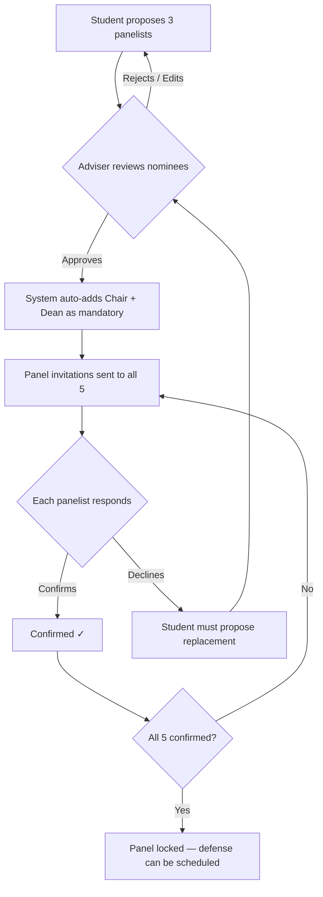

# Integrated Student Research & Capstone Portal

> **Client:** ISUFST — CICT, Dingle Campus
> **Stack:** Turborepo · Next.js 15 (App Router) · Prisma · Supabase (Auth, Storage, PostgreSQL) · PWA
> **Branding:** Maroon & Gold academic aesthetic
> **Status:** ~65% complete — Architecture, Auth, DB schema, core UI, landing page done
> **Last Updated:** May 16, 2026

---

## Current Status

| Area | Status | Notes |
|---|---|---|
| Monorepo structure | ✅ Done | Turborepo, pnpm workspaces, 7 packages |
| Database schema | ✅ Done | 15 models, 11 enums, all relations wired |
| Supabase Auth | ✅ Done | `@supabase/ssr`, RBAC middleware, login + register |
| UI components | ✅ Partial | Button, Card, Badge, DocumentViewer, FileUpload done |
| Landing page | ✅ Done | Redesigned with nav, hero, stats, features, CTA, footer |
| Student routes | ⚠️ Partial | Dashboard, documents, milestones, title-check done |
| Faculty routes | ⚠️ Partial | Dashboard, evaluation pages done |
| Admin routes | ⚠️ Partial | Dashboard (charts), rubrics (read-only), defense-schedule (mock) |
| PWA | ❌ Not wired | `@serwist/next` installed but not configured |
| Tests | ❌ None | Zero test files |
| Vercel deployment | ✅ Configured | `vercel.json` with `rootDirectory: apps/web` |

See [`IMPLEMENTATION_REPORT.md`](./IMPLEMENTATION_REPORT.md) for the full audit.

---

## Proposed Changes

### Monorepo Structure

```
capstone-portal/
├── apps/
│   └── web/                         # Single Next.js 15 app (App Router + RSC)
│       ├── public/                  # PWA manifest, icons (SW not yet configured)
│       ├── .env / .env.local        # Supabase + DB credentials (gitignored)
│       ├── src/
│       │   ├── app/
│       │   │   ├── page.tsx         # Landing page (nav, hero, stats, features, CTA, footer)
│       │   │   ├── login/           # Email/password login
│       │   │   ├── register/        # Registration with role selection
│       │   │   ├── archive/         # Public archive listing + detail
│       │   │   ├── student/         # Student workspace
│       │   │   ├── faculty/         # Adviser & Panel workspace
│       │   │   └── admin/           # Admin dashboard
│       │   ├── middleware.ts        # RBAC route protection
│       │   └── globals.css          # App-specific styles
│       └── next.config.ts
├── packages/
│   ├── ui/                          # Shared UI primitives (Button, Card, Badge, etc.)
│   ├── database/                    # Prisma schema, client, seed scripts, pg_trgm setup
│   ├── storage/                     # Supabase Storage + mammoth DOCX→HTML converter
│   ├── auth/                        # Supabase SSR auth (client.ts + server.ts split)
│   ├── eslint-config/               # Shared ESLint flat config
│   └── typescript-config/           # Shared tsconfig presets
├── turbo.json
├── vercel.json                      # Vercel deployment config
└── package.json
```

> [!NOTE]
> **Styling:** Tailwind CSS v4 confirmed. Maroon (`#800000`) / Gold (`#FFD700`) theme active.
> **Config split:** `packages/config/` was split into `eslint-config/` + `typescript-config/` for cleaner separation.

---

### Route Map

| Route | Key Pages | Access | Status |
|---|---|---|---|
| `/` | Landing page (nav, hero, stats, features, CTA, footer) | Public | ✅ Done |
| `/login` | Email/password login | Auth page | ✅ Done |
| `/register` | Registration with role selection | Auth page | ✅ Done |
| `/archive` | Public archive listing with search | Public | ✅ Done |
| `/archive/[id]` | Project detail page | Public | ✅ Done |
| `student/dashboard` | Student overview | `STUDENT` | ✅ Done |
| `student/project/documents` | Document upload & version list | `STUDENT` | ✅ Done |
| `student/project/documents/view/[id]` | DOCX viewer with HTML rendering | `STUDENT` | ✅ Done |
| `student/project/milestones` | Kanban board (3 columns) | `STUDENT` | ️ Partial |
| `student/project/title-check` | Trigram similarity search | `STUDENT` | ✅ Done |
| `student/group` | Group creation & member management | `STUDENT` | ❌ Missing |
| `student/project/panel` | Panel nomination workflow | `STUDENT` | ❌ Missing |
| `student/project/defense/[stage]` | Defense stage detail | `STUDENT` | ❌ Missing |
| `faculty/dashboard` | Advised groups + panel assignments | `FACULTY` | ✅ Done |
| `faculty/evaluate/[versionId]` | Document annotation interface | `FACULTY` | ⚠️ Partial |
| `faculty/evaluate/project/[projectId]` | Project evaluation overview | `FACULTY` | ⚠️ Partial |
| `faculty/advised/[groupId]` | Advised group detail | `FACULTY` | ❌ Missing |
| `admin/dashboard` | Analytics with 3 charts + overview cards | `ADMIN` | ✅ Done |
| `admin/rubrics` | Rubric viewer (read-only) | `ADMIN` | ⚠️ Partial |
| `admin/defense-schedule` | Static calendar + mock schedule list | `ADMIN` | ️ Partial |
| `admin/users` | User management | `ADMIN` | ❌ Missing |
| `admin/projects` | Project management | `ADMIN` | ❌ Missing |
| `admin/groups` | Group management | `ADMIN` | ❌ Missing |
| `admin/archive` | Admin archive management | `ADMIN` | ❌ Missing |
| `admin/settings` | System settings | `ADMIN` | ❌ Missing |

---

### Database Schema (Prisma + raw SQL for pg_trgm)

#### Core Enums

```prisma
enum UserRole        { STUDENT  FACULTY  ADMIN }
enum FacultyPosition { INSTRUCTOR  PROGRAM_CHAIR  DEAN }
enum GroupStatus      { FORMING  ACTIVE  COMPLETED  DISSOLVED }
enum DefenseStage    { TITLE  PRE_ORAL  TECHNICAL  FINAL }
enum ProjectStatus   { TITLE_PROPOSAL  TITLE_APPROVED  IN_PROGRESS  PRE_ORAL_STAGE
                       TECHNICAL_STAGE  FINAL_STAGE  COMPLETED  ARCHIVED }
enum MilestoneStatus { TODO  IN_PROGRESS  FOR_REVIEW  DONE }
enum PanelStatus     { NOMINATED  CONFIRMED  DECLINED }
enum DocType         { DOCX  PDF }
enum AnnotationType  { COMMENT  SUGGESTION  CORRECTION  MUST_FIX }
enum DefenseVerdict  { PASS  CONDITIONAL  FAIL }
enum Semester        { FIRST  SECOND  SUMMER }
```

#### Tables Overview

| Table | Purpose | Key Relations |
|---|---|---|
| `users` | All users synced from Supabase Auth | role, faculty_position |
| `capstone_groups` | Student groups (4-5 members) | → adviser (users), → members |
| `group_members` | Junction: user ↔ group | role_in_group (LEADER/MEMBER) |
| `capstone_projects` | One per group, the core entity | → group, → panel, → documents |
| `panel_assignments` | 5 panelists per project (3 nominated + chair + dean) | confirmation workflow flags |
| `document_versions` | Versioned .docx/.pdf uploads | auto-incrementing version_number |
| `document_annotations` | Paragraph-level comments on document HTML | paragraph_index, text selection offsets |
| `milestones` | Kanban items per project | status columns, ordering |
| `evaluation_rubrics` | Admin-editable rubric templates per defense stage | one active rubric per stage |
| `rubric_criteria` | Individual criteria within a rubric | category, max_score, weight |
| `defense_schedules` | Scheduled defense events | date, venue, stage |
| `evaluations` | One per panelist per defense | → rubric, verdict, total score |
| `evaluation_scores` | Individual criteria scores within an evaluation | score, comment |
| `historical_titles` | Seeded + accumulated titles for pg_trgm | GIN-indexed |
| `notifications` | In-app notification feed | type, link, is_read |

#### Key Schema Details

```prisma
model User {
  id               String          @id @default(uuid()) // synced with Supabase Auth
  email            String          @unique
  firstName        String
  lastName         String
  role             UserRole
  facultyPosition  FacultyPosition? // only for FACULTY
  avatarUrl        String?
  studentNumber    String?          // only for STUDENT
  department       String           @default("CICT")
  isActive         Boolean          @default(true)
  createdAt        DateTime         @default(now())
  updatedAt        DateTime         @updatedAt

  // Relations
  advisedGroups    CapstoneGroup[]  @relation("Adviser")
  groupMemberships GroupMember[]
  panelAssignments PanelAssignment[]
  evaluations      Evaluation[]
  annotations      DocumentAnnotation[]
  notifications    Notification[]
}

model CapstoneProject {
  id                  String        @id @default(uuid())
  groupId             String        @unique
  title               String
  abstract            String?
  techStack           String[]      @default([])
  domain              String?       // agriculture, aquaculture, campus_automation, etc.
  status              ProjectStatus @default(TITLE_PROPOSAL)
  currentDefenseStage DefenseStage?
  isPublic            Boolean       @default(false)
  createdAt           DateTime      @default(now())
  updatedAt           DateTime      @updatedAt

  group             CapstoneGroup       @relation(fields: [groupId], references: [id])
  panelAssignments  PanelAssignment[]
  documentVersions  DocumentVersion[]
  milestones        Milestone[]
  defenseSchedules  DefenseSchedule[]
  evaluations       Evaluation[]
}

model DocumentVersion {
  id            String   @id @default(uuid())
  projectId     String
  versionNumber Int      // auto-incremented per project
  fileName      String
  fileUrl       String   // Supabase Storage URL
  fileType      DocType
  fileSize      BigInt
  htmlContent   String?  // mammoth.js conversion for annotation
  defenseStage  DefenseStage?
  uploadedBy    String
  createdAt     DateTime @default(now())

  project     CapstoneProject      @relation(fields: [projectId], references: [id])
  uploader    User                 @relation(fields: [uploadedBy], references: [id])
  annotations DocumentAnnotation[]

  @@unique([projectId, versionNumber])
}

model DocumentAnnotation {
  id                String         @id @default(uuid())
  documentVersionId String
  authorId          String
  paragraphIndex    Int
  selectedText      String?
  startOffset       Int?
  endOffset         Int?
  comment           String
  annotationType    AnnotationType @default(COMMENT)
  isResolved        Boolean        @default(false)
  resolvedBy        String?
  createdAt         DateTime       @default(now())
  updatedAt         DateTime       @updatedAt

  documentVersion DocumentVersion @relation(fields: [documentVersionId], references: [id])
  author          User            @relation(fields: [authorId], references: [id])
}
```

#### pg_trgm Setup (Raw SQL Migration)

```sql
-- Enable extension
CREATE EXTENSION IF NOT EXISTS pg_trgm;

-- GIN index on historical titles
CREATE INDEX idx_historical_titles_trgm
ON historical_titles USING GIN (title gin_trgm_ops);

-- Similarity search function
CREATE OR REPLACE FUNCTION search_similar_titles(query_title TEXT, threshold FLOAT DEFAULT 0.3)
RETURNS TABLE(id UUID, title TEXT, year INT, similarity FLOAT) AS $$
  SELECT id, title, year, similarity(title, query_title) AS similarity
  FROM historical_titles
  WHERE similarity(title, query_title) >= threshold
  ORDER BY similarity DESC
  LIMIT 20;
$$ LANGUAGE sql;
```

**Similarity Thresholds:**
- `≥ 0.3` — Informational: "Related titles found" (gray badge)
- `≥ 0.5` — Warning: "Similar title exists" (yellow warning)
- `≥ 0.7` — Blocking: "Likely duplicate — requires adviser override" (red alert)

---

### Panel Nomination & Confirmation Workflow



---

### Document Annotation System

**Upload Flow:**
1. Student uploads `.docx` → stored in Supabase Storage bucket `manuscripts`
2. Server Action runs `mammoth.js` to convert `.docx` → structured HTML
3. HTML stored in `document_versions.htmlContent`
4. Version number auto-incremented via DB query (`MAX(version_number) + 1`)

**Annotation UI:**
1. HTML rendered in a custom `<DocumentViewer>` component
2. Each `<p>` tag wrapped with a clickable annotation target (paragraph index)
3. Faculty selects text → annotation sidebar opens with comment form
4. Annotations displayed as highlighted text with margin indicators
5. Filter by: annotation type, resolved status, author
6. Students see annotations as read-only with a "Mark as Addressed" action

**PDF Handling:**
- PDFs rendered via `react-pdf` for viewing only
- Annotations on PDFs use page-level comments (simpler than paragraph-level)

---

### Defense Evaluation System

**4-Stage Pipeline:**

| Stage | Typical Focus | Triggers |
|---|---|---|
| Title Defense | Feasibility, relevance, originality | After title proposal + panel lock |
| Pre-Oral Defense | Lit review, methodology, progress | After Ch1-3 submission |
| Technical Defense | Implementation, testing, code quality | After system demo |
| Final Defense | Complete evaluation, manuscript quality | After final manuscript |

**Rubric Builder (Admin):**
- Admin creates/edits rubric templates per defense stage
- Each rubric has criteria grouped by category (e.g., "Content", "Technical Merit", "Presentation")
- Each criterion has: name, description, max_score (1-10 default), weight (%)
- Weights within a rubric must total 100%
- Only one active rubric per defense stage at a time

**Grading Flow:**
1. Admin schedules defense → panelists notified
2. During/after defense, each panelist fills out the digital rubric
3. System computes: `panelist_total = Σ(score × weight)` for each panelist
4. Final grade = `AVG(all_panelist_totals)`
5. Each panelist also selects a verdict: PASS / CONDITIONAL / FAIL
6. Majority verdict determines outcome

---

### PWA Configuration

Using `@serwist/next` (modern successor to `next-pwa`):

- **Manifest:** App name, maroon theme color, icons (192×192, 512×512)
- **Service Worker:** Cache-first for static assets, network-first for API calls
- **Offline:** Basic offline page with "You're offline" message
- **Install Prompt:** Custom install banner for mobile users

---

### Supabase Configuration

**Storage Buckets:**

| Bucket | Purpose | RLS Policy |
|---|---|---|
| `manuscripts` | .docx and .pdf uploads | Group members + assigned panel + admin |
| `avatars` | Profile pictures | Owner + admin |

**Auth:**
- Email/password registration with email verification
- Role assigned during registration (student vs faculty selection)
- Admin accounts created via seed or admin panel invitation

**Row-Level Security:**
- Manuscripts: `auth.uid() IN (group_members) OR auth.uid() IN (panel_assignments) OR role = 'ADMIN'`
- Avatars: `auth.uid() = owner_id OR role = 'ADMIN'`

---

### Key Libraries

| Library | Status | Purpose |
|---|---|---|
| `mammoth` | ✅ Installed | .docx → HTML conversion (server-side) |
| `react-pdf` | ❌ Missing | PDF viewing in browser |
| `@hello-pangea/dnd` | ✅ Installed | Kanban drag-and-drop |
| `recharts` | ✅ Installed | Analytics charts |
| `@serwist/next` | ⚠️ Installed, not wired | PWA service worker |
| `zod` | ❌ Missing | Schema validation |
| `react-hook-form` | ❌ Missing | Form state management |
| `lucide-react` | ✅ Installed | Icon library |
| `date-fns` | ✅ Installed | Date formatting |
| `sonner` | ✅ Installed | Toast notifications |

---

## Phase Breakdown

### Phase 1: Architecture & Security — ✅ COMPLETE

#### Turborepo Initialization — ✅ Done
- `turbo.json`, root `package.json`, `pnpm-workspace.yaml`
- Shared configs split into `packages/eslint-config/` + `packages/typescript-config/`

#### `apps/web` — Next.js 15 App — ✅ Done
- App Router with route groups: `student/`, `faculty/`, `admin/`
- Global layout with maroon/gold design tokens, Inter/Outfit typography
- Landing page redesigned: nav, hero, stats, features, CTA, footer
- Responsive layout

#### `packages/auth` — ✅ Done
- Supabase Auth client utilities (`client.ts` + `server.ts` split)
- `middleware.ts` — RBAC route protection: redirect by role, block unauthorized access
- Login + Register pages with Supabase email/password auth

#### `packages/ui` — ✅ Partial
- Design system primitives: Button, Card, Badge, DocumentViewer, FileUpload
- Maroon/gold theme via Tailwind v4 `@theme` directive
- Missing: Input, Modal, Tabs, Avatar, Dropdown

#### `packages/database` — ✅ Done
- Full Prisma schema (15 models, 11 enums)
- Raw SQL migration for `pg_trgm` extension + GIN index (`setup-pg-trgm.ts`)
- Prisma Client singleton export
- Seed script with basic data (3 faculty, 5 students, 1 group, 1 project, 6 titles, 4 rubrics)

#### `packages/storage` — ✅ Done
- Supabase Storage client for `manuscripts` and `avatars` buckets
- Upload, download, delete utilities
- `mammoth.js` DOCX→HTML conversion
- Bucket setup script

---

### Phase 2: Core Data Layer & Search — ️ Partial

#### Database Seed Script — ️ Partial
- ✅ 3 faculty users (1 dean, 1 chair, 1 instructor) — plan called for 5
- ✅ 5 student users in 1 group — plan called for 15 across 3 groups
- ✅ 1 sample project — plan called for 3
-  6 historical titles — plan called for 50+
- ✅ Default rubrics for all 4 defense stages

#### Title Verification — ✅ Done
- ✅ Server Action: `search_similar_titles()` via `prisma.$queryRawUnsafe`
- ✅ Debounced frontend input with live results
- ⚠️ Thresholds: API uses 0.2, UI uses 0.4/0.7 (plan specified 0.3/0.5/0.7)

#### User Registration Flow — ✅ Done
- ✅ Role selection (Student / Faculty / Admin)
- ✅ Supabase Auth signup with `user_metadata.role`
- ✅ Middleware redirects logged-in users away from auth pages

---

### Phase 3: Capstone Workspace — ⚠️ Partial

#### Group Management (`student/group`) — ❌ Not started
- Create group: leader invites 3-4 members by email/student number
- Join group: accept/decline invitation
- Admin fallback: `admin/groups` page to manually assign students

#### Document Repository (`student/project/documents`) — ✅ Done
- ✅ Upload interface: drag-and-drop `.docx`/`.pdf` with validation
- ✅ Server Action: upload → mammoth conversion → save version record
- ✅ Version history: list of all versions with download, view
- ✅ "View Document" opens `<DocumentViewer>` with rendered HTML

#### Kanban Milestone Tracker (`student/project/milestones`) — ️ Partial
- ✅ Drag-and-drop reordering via `@hello-pangea/dnd`
- ⚠️ Only 3 columns (TODO, IN_PROGRESS, DONE) — plan calls for 4 (missing FOR_REVIEW)
- ⚠️ Due dates displayed but no date picker
- ❌ No assignee per milestone

#### Panel Nomination (`student/project/panel`) — ❌ Not started
- Search faculty directory → nominate 3 panelists
- View mandatory panelists (chair + dean) — auto-assigned
- Track confirmation status per panelist
- Adviser approval step before invitations go out

#### Title Proposal Interface (`student/project/title-check`) — ✅ Done
- ✅ Form: proposed title + brief description
- ✅ Live trigram search with severity badges
- ⚠️ "Submit for Approval" flow not fully wired

---

### Phase 4: Evaluation & Feedback — ️ Partial

#### Document Annotation System (`faculty/evaluate/[versionId]`) — ⚠️ Partial
- ✅ `<DocumentViewer>`: renders mammoth HTML with paragraph indexing
- ✅ Text selection → annotation popover (type, comment)
- ✅ Annotation sidebar: comments per paragraph
- ⚠️ Filter controls: UI exists but not fully wired
- ✅ Student view: read-only annotations with "Addressed" toggle

#### Rubric Builder (`admin/rubrics`) — ️ Partial
- ✅ View rubrics per stage (read-only)
- ✅ Weight validation (shows error when weights don't sum to 100%)
- ❌ CRUD interface: buttons exist but non-functional
- ❌ Activate/deactivate toggle
- ❌ Preview-as-panelist mode

#### Defense Grading (`faculty/evaluate/project/[projectId]`) — ⚠️ Partial
- ⚠️ Digital scoresheet UI exists but not fully wired
- ⚠️ Auto-computed weighted total: logic exists but not connected to UI
- ⚠️ Verdict selection: UI exists but submission not wired
-  Submit locks evaluation

#### Defense Scheduling (`admin/defense-schedule`) — ⚠️ Partial
- ⚠️ Calendar view: static grid hardcoded to May 2026
- ️ Schedule list: mock data (2 hardcoded entries), not from DB
- ❌ DB integration: no queries to `DefenseSchedule` model
- ❌ Auto-notify panelists
- ❌ Status tracking (Scheduled → In Progress → Completed)

---

### Phase 5: Archive & Analytics — ️ Partial

#### Analytics Dashboard (`admin/dashboard`) — ✅ Partial
- ✅ Overview cards: Total Projects, Students, Faculty, Completion Rate
- ✅ Cohort Velocity (AreaChart)
- ✅ Domain Distribution (PieChart/donut)
- ✅ Defense Pass Rates (BarChart)
- ❌ Deliverable Delays heatmap
- ❌ Active Users engagement metrics

#### Public Archive (`/archive`) — ️ Partial
- ✅ SSR listing with search (query + domain filter)
- ✅ Project detail page: full details, team, panel
- ❌ pg_trgm-powered fuzzy search: uses basic `contains`, not `search_similar_titles`
- ❌ Download manuscript: button exists but non-functional
- ⚠️ SEO: basic metadata, no OG tags

---

### Phase 6: QA, Optimization & Deployment — ❌ Not started

#### Testing Strategy
- ❌ **Unit:** No test files, no `test` scripts
- ❌ **Integration:** No test files
-  **E2E:** No Playwright config or tests
- ❌ **Browser:** PWA not configured

#### Performance Optimization
- ✅ React Server Components for data-heavy pages
- ️ Dynamic imports: not applied to heavy components
- ✅ Image optimization via `next/image` (configured in next.config.ts)
- ⚠️ DB query optimization: basic queries, no pagination yet
- ❌ Signed URLs with expiry for manuscript downloads

#### Deployment
- ✅ **Vercel:** `vercel.json` configured with `rootDirectory: apps/web`
- ✅ **Supabase Cloud:** Project exists, env vars configured
- ❌ **Domain:** No custom domain configured
- ❌ **PWA:** Lighthouse PWA audit not run (PWA not wired)

---

## Open Questions

> [!NOTE]
> **Resolved:** Tailwind CSS v4 confirmed and active. Maroon/gold theme working.
> **Resolved:** Faculty registration uses direct signup (no admin approval gate).
> **Resolved:** Vercel deployment configured with `rootDirectory: apps/web`.

> [!IMPORTANT]
> **Faculty Registration Approval:** Currently direct signup. Should faculty accounts require admin approval before activation? This affects the auth flow complexity.

> [!NOTE]
> **Notification Delivery:** The `Notification` model exists but no delivery mechanism. Do you want email notifications (panel invitation, defense scheduled)? This would require a transactional email service (Resend, SendGrid, or Supabase Edge Functions).

> [!NOTE]
> **Academic Year Scoping:** The `Semester` enum is missing from the schema. Should the portal support multiple academic years simultaneously, or is it strictly one active cohort at a time?

> [!NOTE]
> **PDF Viewing:** `react-pdf` is not installed. PDFs currently show a placeholder. Should we add PDF rendering support?

> [!NOTE]
> **Dark Mode:** Only light theme is defined. Should dark mode be added?

---

## Verification Plan

### Automated Tests
- ❌ `pnpm test` — no unit tests written (grade computation, similarity thresholds, validation schemas)
- ❌ `pnpm test:e2e` — no Playwright tests (auth flow, document upload, defense grading)
- ❌ Lighthouse CI — PWA audit, performance, accessibility scores not run

### Manual Verification
- ✅ Build passes: `pnpm build` completes with zero errors
- ✅ Local dev: `pnpm dev` runs on `http://localhost:3000`
- ✅ Vercel: `vercel.json` configured, env vars set
- ⚠️ Auth flow: login + register pages work, but no test users seeded yet
- ⚠️ Document upload: UI works, but Supabase Storage buckets need to be created
- ️ Annotation system: UI renders, but full workflow not tested
- ❌ PWA: not wired up, install prompt won't work
- ❌ Mobile responsiveness: not tested on actual devices
- ❌ pg_trgm similarity: not tested with real-world title variations

### Pre-Production Checklist
- [ ] Wire up `@serwist/next` in `next.config.ts` + create `sw.ts`
- [ ] Add `zod` + `react-hook-form` to all forms
- [ ] Fix Prisma env var alignment (`DATABASE_URL` vs `NEXT_POSTGRES_PRISMA_URL`)
- [ ] Add `Semester` enum to schema
- [ ] Install `react-pdf` for PDF viewing
- [ ] Expand seed data (50+ titles, 3 groups, 15 students, 3 projects)
- [ ] Add unit tests for grade computation, similarity scoring, validation
- [ ] Add E2E tests with Playwright
- [ ] Run Lighthouse PWA audit (target ≥ 90)
- [ ] Test on iOS Safari + Android Chrome
